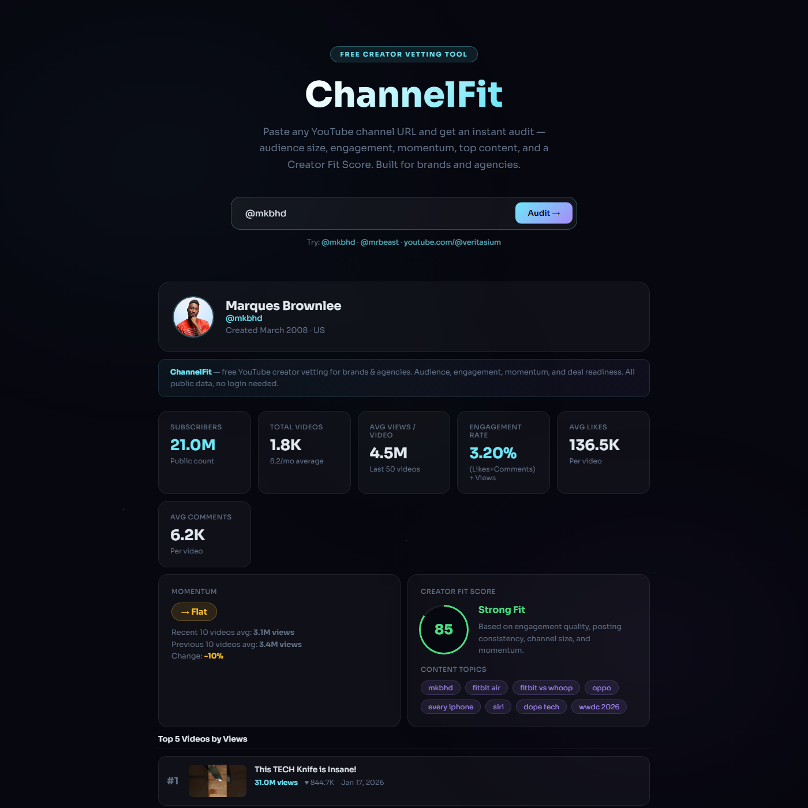

# ChannelFit

**Free YouTube creator vetting tool for brands and agencies.**

Paste any YouTube channel URL or `@handle` and get an instant audit: subscriber count, average views per video, engagement rate, posting frequency, top 5 performing videos, content topics, momentum (rising/declining), and a Creator Fit Score — all from public data, no signup or account connection required.

🔗 **Live demo:** https://silver-piroshki-470a9d.netlify.app



## Why

When a brand wants to know "should we work with this creator?", they either pay $500+/month for a full influencer platform or manually piece together numbers from YouTube. ChannelFit gives you the handful of numbers that actually matter before making a deal — in seconds.

## Features

- Channel overview: subscribers, total videos, channel age
- Average views, likes, and comments per video (last 50 uploads)
- Engagement rate `(likes + comments) / views`
- Posting frequency (videos/month)
- Momentum indicator comparing recent vs. previous uploads
- Creator Fit Score (0–100) based on engagement, consistency, size, and momentum
- Top 5 videos by views with thumbnails and stats
- Auto-detected content topics from video tags

## Tech stack

- Static HTML/CSS/JS frontend (`public/`)
- Netlify Functions (serverless) wrapping the YouTube Data API v3 (`netlify/functions/`)
- Deployed on Netlify

## Local development

1. Clone the repo and install dependencies:
   ```bash
   npm install
   ```
2. Create a `.env` file with your own YouTube Data API v3 key (see [Getting a YouTube Data API key](#getting-a-youtube-data-api-key) below):
   ```
   YOUTUBE_API_KEY=your_key_here
   ```
3. Run with the Netlify CLI (serves the static site + functions together):
   ```bash
   npx netlify dev
   ```

### Getting a YouTube Data API key

1. Go to the [Google Cloud Console](https://console.cloud.google.com/).
2. Create a new project (or select an existing one) from the project dropdown at the top.
3. In the left sidebar, go to **APIs & Services → Library**, search for **YouTube Data API v3**, and click **Enable**.
4. Go to **APIs & Services → Credentials**, click **Create Credentials → API key**.
5. Copy the generated key.
6. (Optional but recommended) Click **Restrict key** and limit it to the **YouTube Data API v3** so it can't be used for other Google APIs.
7. In the project folder, create a file named `.env` (same folder as `package.json`) and add:
   ```
   YOUTUBE_API_KEY=your_key_here
   ```
   `.env` is already listed in `.gitignore`, so it won't be committed to git.

The free tier includes 10,000 quota units/day, which is plenty for personal use and testing — each channel audit uses roughly 100-150 units.

## Deployment

This project deploys to Netlify. The `netlify.toml` config routes `/api/*` requests to the serverless functions in `netlify/functions/`. Set `YOUTUBE_API_KEY` as an environment variable in your Netlify site settings before deploying.

## Roadmap / Potential Upcoming Updates

- **Cross-platform analytics** — pull in Snapchat, Instagram, and Facebook stats so brands can see a creator's full footprint, not just YouTube
- **Brand recommendations** — suggest the types of brands/products that would fit well with a given channel based on its content and audience
- **Niche matching** — identify the creator's niche and recommend a few other channels in the same space, useful for finding alternatives or building a creator shortlist
- **Niche benchmarking** — compare a channel's stats (subscribers, engagement, views) against others in the same niche to show how they stack up relative to peers
